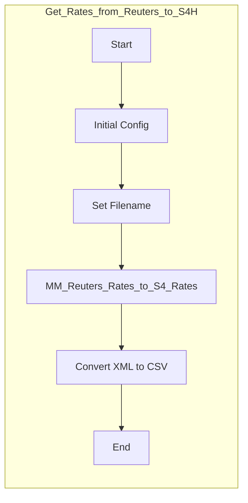

<?xml version='1.0' encoding='UTF-8'?><root><candidates><avgLogprobs>-0.18115762366250648</avgLogprobs><content><parts><text># Technical Specification: P002-IF001_-_Reuters_to_SAP_-_Get_Rates

This document provides a detailed technical specification for the SAP Cloud Integration flow `P002-IF001_-_Reuters_to_SAP_-_Get_Rates`. It is intended for technical and functional experts to understand the interface's design, purpose, and behavior.

### 1. Document Header

| Attribute | Value |
| :--- | :--- |
| **Integration Flow Name** | `P002-IF001_-_Reuters_to_SAP_-_Get_Rates` |
| **Version** | `1.0.4` |
| **Integration Package** | `CUSTOMER_Elopak` |
| **Created By** | `Maxime.Walravens@flexso.com` |
| **Last Modified By** | `Maxime.Walravens@flexso.com` |

---

### 2. Externalized Parameters

Externalized parameters allow for environment-specific configuration of the integration flow without requiring any changes to the core integration logic. The following parameters are configured for this iFlow:

| Name | Configured Value | Description |
| :--- | :--- | :--- |
| `SMB_Domain` | `elopak.int` | The domain for the SMB (Server Message Block) file share connection. |
| `SAP_Receiver` | `S4H` | The logical name of the receiving SAP system. |
| `SFTP_Timeout` | `10000` | The connection timeout in milliseconds for the SFTP server. |
| `SMB_Directory` | `${property.targetDirectory}` | The target directory on the SMB share, dynamically set from a property. |
| `SFTP_Authentication` | `user_password` | The authentication method used for the SFTP server (user/password). |
| `SMB_Proxy` | `onPremise` | The proxy configuration for the SMB connection. |
| `SFTP_PostProcessing` | `test` | The post-processing action for files on the SFTP server. (Note: `noop` is the effective value). |
| `SMB_Credentials` | `Z_NETAPP_MK` | The credential name for accessing the SMB share. |
| `SFTP_Directory` | `/` | The source directory on the SFTP server from which to read files. |
| `SMB_Share` | `jdfqec$` | The specific share name on the SMB server. |
| `targetSystem` | `QEC` | A property identifying the target system environment (e.g., Quality). |
| `SFTP_FIlename` | `*` | The file name pattern to be picked up from the SFTP server (wildcard for all files). |
| `SAP_Sender` | `Reuters` | The logical name of the sending system (Reuters). |
| `SMB_Timeout` | `180` | The timeout in seconds for the SMB connection. |
| `SAP_MessageType` | `Rates` | The message type identifier used for SAP system communication. |
| `SFTP_Scheduler` | (Complex Value) | The schedule for the SFTP adapter poll. Configured to run every 10 seconds. |
| `SFTP_Address` | `164.57.211.93` | The IP address of the Reuters SFTP server. |
| `SFTP_Credential` | `Reuters_SFTP` | The credential name for logging into the Reuters SFTP server. |
| `SMB_Filename` | `${property.targetFilename}` | The target filename on the SMB share, dynamically set from a property. |
| `SAP_ApplicationID` | | The application ID for SAP communication (currently empty). |
| `SMB_Address` | `netapp.fileshare:445` | The address and port of the SMB file share server. |

---

### 3. Integration Process Overview

This integration flow contains a single local integration process:

*   Get Rates from Reuters to S4H

The diagram below illustrates the sequence of steps executed within the integration flow.



---

### 4. Integration Flow Triggers

The integration flow is initiated by a single trigger mechanism:

*   **SFTP Adapter (Start Event)**
    *   **Type:** Polling Adapter
    *   **Description:** The flow is scheduled to automatically connect to an external SFTP server and read files that match a specific pattern.
    *   **Configuration Details:**
        *   **Address:** `164.57.211.93` (via `{{SFTP_Address}}`)
        *   **Directory:** `/` (via `{{SFTP_Directory}}`)
        *   **File Name:** `*` (via `{{SFTP_FIlename}}`), meaning it will process all files in the directory.
        *   **Schedule:** The adapter polls the SFTP server every 10 seconds (`0/10 * 0-24 ? * * *`) according to the `SFTP_Scheduler` parameter.
        *   **Post-Processing:** Files are left on the server after processing (`noop={{SFTP_PostProcessing}}`).

---

### 5. Detailed Process Breakdown

#### Get Rates from Reuters to S4H

**a. Purpose**

The purpose of this process is to fetch financial rate files from a Reuters SFTP server, transform the data into a format required by SAP S/4HANA, and prepare it for further processing. The flow dynamically determines file names, maps the source XML data to a target XML structure, and finally converts this XML into a fixed-width text file.

**b. Step-by-Step Analysis**

**1. Initial Config**

This Content Modifier step initializes the message with required headers and properties for processing.

**Headers**

| Action | Type | Name | Value | Data Type | Description |
| :--- | :--- | :--- | :--- | :--- | :--- |
| Create | constant | `SAP_Sender` | `{{SAP_Sender}}` | `java.lang.String` | Sets the sending system identifier from the externalized parameter. |
| Create | constant | `SAP_Receiver` | `{{SAP_Receiver}}` | `java.lang.String` | Sets the receiving system identifier from the externalized parameter. |
| Create | constant | `SAP_MessageType`| `{{SAP_MessageType}}` | `java.lang.String` | Sets the message type from the externalized parameter. |
| Create | constant | `SAP_ApplicationID` | `{{SAP_ApplicationID}}` | `java.lang.String` | Sets the application ID from the externalized parameter. |

**Properties**

| Action | Type | Name | Value | Data Type | Description |
| :--- | :--- | :--- | :--- | :--- | :--- |
| Create | constant | `targetSystem` | `{{targetSystem}}` | `java.lang.String` | Sets a property to identify the target system environment. |
| Create | expression | `initialPayload` | `${in.body}` | `java.lang.String` | Stores the original incoming file content in a property for potential later use. |

**Body**

Not configured. The message body from the SFTP file is passed through unchanged.

---

**2. Set Filename**

This step executes a Groovy script to determine the correct output filename and directory based on the name of the input file.

*   **Purpose:** To dynamically construct target file and directory names for different types of rate files received from Reuters. Files that do not match known patterns are routed to an error directory.

*   **Source Code:**

```groovy
import com.sap.gateway.ip.core.customdev.util.Message;
import java.text.SimpleDateFormat;

def Message processData(Message message) {
    // Retrieve the original filename from the message header set by the SFTP adapter.
    def sourceFilename = message.getHeaders().get("CamelFileName");
    
    // Generate a timestamp string in 'yyyyMMdd-HHmmss' format.
    def timestamp = new SimpleDateFormat("yyyyMMdd-HHmmss").format(new Date());
    
    // Default values for filename and directory, used for unrecognized files.
    def targetFilename = "unprocessed_" + sourceFilename;
    def targetDirectory = "/DSS/error";

    // Check if the source filename matches known patterns and set target names accordingly.
    if (sourceFilename.startsWith("ELOPAK_INTRADAY")) {
        targetFilename = "ELOPAK_INTRADAY_" + timestamp + ".txt";
        targetDirectory = "/DSS/inbound";
    } else if (sourceFilename.startsWith("Elopak_SAR-EUR")) {
        targetFilename = "Elopak_SAR-EUR_" + timestamp + ".txt";
        targetDirectory = "/DSS/inbound";
    } else if (sourceFilename.startsWith("ELOPAK PLN")) {
        targetFilename = "RATES_PNB_UNB_" + timestamp + ".txt";
        targetDirectory = "/DSS/inbound";
    } else if (sourceFilename.startsWith("elopak eod rub")) {
        targetFilename = "RATES_EOD_RUB_" + timestamp + ".txt";
        targetDirectory = "/DSS/inbound";
    }

    // Set the generated filename and directory as properties on the message.
    // These properties are used later to configure the SMB adapter.
    message.setProperty("targetFilename", targetFilename.toString());
    message.setProperty("targetDirectory", targetDirectory.toString());
    
    return message;
}
```

---

**3. MM_Reuters_Rates_to_S4_Rates**

This step performs a message mapping to transform the incoming Reuters XML structure into a target XML format expected by SAP.

*   **Field Mapping Table:**

| Target Field | Mapping Type / Function(s) | Transformation Logic (Human Readable) | Source Field(s) |
| :--- | :--- | :--- | :--- |
| `ns0:MT_ECC_MarketData/Lines` | (Root Level) | Maps each `Row` to a `Lines` element. | `/Report/Data/Row` |
| `Lines/Class` | `if`, `concat` | If the source `User_Defined_Identifier` has a length less than 2, it is prefixed with a "0". Otherwise, it's mapped directly. | `User_Defined_Identifier` |
| `Lines/Key1` | Direct | Directly maps the source field to the target. | `User_Defined_Identifier2` |
| `Lines/Key2` | Direct | Directly maps the source field to the target. | `User_Defined_Identifier3` |
| `Lines/Category` | Direct | Directly maps the source field to the target. | `User_Defined_Identifier4` |
| `Lines/Date` | `if`, `TransformDate` | If `Trade_Date` is empty, use the current date. The date format is then converted from `dd/MM/yyyy` to `ddMMyyyy`. | `Trade_Date` |
| `Lines/Time` | `currentDate` | The target field is populated with the current system time in `HHmm` format. | (None) |
| `Lines/Value` | `if`, `not`, `stringEquals`, `replaceString` | This is a complex rule: 1. If `RIC` equals "EURRUBFIX=", use `Primary_Activity` (commas removed). 2. Else, if `Primary_Activity` is not "N.A.", use `Universal_Close_Price` (commas removed). 3. Else, use `Primary_Activity_2` (commas removed). 4. A default value of "N.A." is used if no conditions are met. | `RIC`, `Primary_Activity`, `Primary_Activity_2`, `Universal_Close_Price` |
| `Lines/Currency` | `constant` | Mapped to a constant empty string. | (None) |
| `Lines/FromF` | Direct | Directly maps the source field to the target. | `User_Defined_Identifier5` |
| `Lines/ToF` | Direct | Directly maps the source field to the target. | `User_Defined_Identifier6` |
| `Lines/Term` | `ifWithoutElse`, `FixValues`, UDF | If `User_Defined_Identifier` is "21", this logic executes: it extracts the last two characters before "=" from `RIC` and uses a lookup table (`FixValues`) to convert text values (e.g., "1Y", "1W", "6M") to a number of days (e.g., "360", "7", "180"). | `User_Defined_Identifier`, `RIC` |
| `*S4_Filename` | `constant` | This field is mapped to the static string "Constant". | (None) |

---

**4. Convert XML to CSV**

This Groovy script step converts the XML payload from the preceding mapping step into a fixed-width string format.

*   **Purpose:** To transform the structured XML output of the mapping into a flat file where each field has a predefined length, padded with spaces if necessary.

*   **Source Code:**

```groovy
import com.sap.gateway.ip.core.customdev.util.Message;
import groovy.util.XmlParser;

/**
 * Helper function to format a string to a fixed length.
 * It pads with spaces if too short or truncates if too long.
 * @param text The input string.
 * @param length The desired fixed length.
 * @return The formatted string.
 */
def String formatField(String text, int length) {
    if (text == null) {
        text = ""; // Ensure nulls are handled as empty strings.
    }
    
    if (text.length() > length) {
        // Truncate the string if it exceeds the specified length.
        return text.substring(0, length);
    }
    
    if (text.length() &lt; length) {
        // Pad the string with trailing spaces to meet the desired length.
        return String.format("%-" + length + "s", text);
    }
    return text;
}

def Message processData(Message message) {
    // Get the message body (XML string) from the previous step.
    def body = message.getBody(String.class);
    
    // Parse the XML string into a Groovy object.
    def root = new XmlParser().parseText(body);
    
    // Use a StringBuilder for efficient string concatenation.
    def sBuilder = new StringBuilder();
    
    // Define the fixed lengths for each field in the output record.
    def lengths = [2, 20, 20, 15, 8, 6, 20, 20, 7, 7, 5];
    
    // Iterate over each &lt;Lines> element in the XML.
    root.Lines.each { line ->
        // Create a list of all field values for the current record.
        def fields = [
            line.Class.text(),     // Length 2
            line.Key1.text(),      // Length 20
            line.Key2.text(),      // Length 20
            line.Category.text(),  // Length 15
            line.Date.text(),      // Length 8
            line.Time.text(),      // Length 6
            line.Value.text(),     // Length 20
            line.Currency.text(),  // Length 20
            line.FromFx.text(),    // Length 7
            line.ToFx.text(),      // Length 7
            line.Term.text()       // Length 5
        ];
        
        // Loop through the fields and format each one to its specified length.
        for (int i = 0; i &lt; fields.size(); i++) {
            sBuilder.append(formatField(fields[i], lengths[i]));
        }
        
        // Append a carriage return and newline character to terminate the line.
        sBuilder.append("\r\n");
    }
    
    // Set the newly constructed fixed-width string as the message body.
    message.setBody(sBuilder.toString());
    
    return message;
}
```

---

**5. End**

This is a Message End Event. It signifies the successful completion of the integration process. At this point, the message processing for a single file is finished, and the iFlow will await the next scheduled poll or the next file in the current poll.</text></parts><role>model</role></content><finishReason>STOP</finishReason></candidates><createTime>2025-12-05T12:40:56.531671Z</createTime><modelVersion>gemini-2.5-pro</modelVersion><responseId>2NIyade5INaymPUP-5K2CQ</responseId><usageMetadata><candidatesTokenCount>3861</candidatesTokenCount><candidatesTokensDetails><modality>TEXT</modality><tokenCount>3861</tokenCount></candidatesTokensDetails><promptTokenCount>9870</promptTokenCount><promptTokensDetails><modality>TEXT</modality><tokenCount>9870</tokenCount></promptTokensDetails><thoughtsTokenCount>1910</thoughtsTokenCount><totalTokenCount>15641</totalTokenCount><trafficType>ON_DEMAND</trafficType></usageMetadata></root>